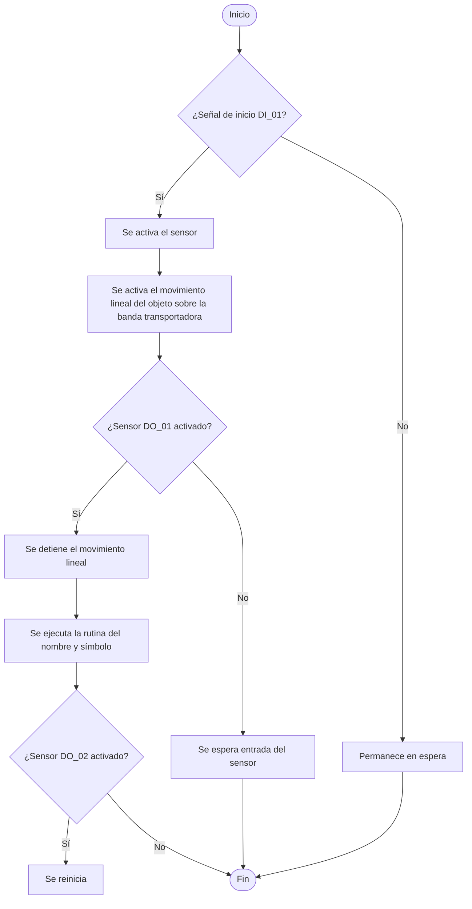

# Laboratorio-2-Robotica-Industrial

**Juliana Gongora Rasmussen**

_Ingeniería Mecatrónica_

Correo: jugongorar@unal.edu.co

---

**Gerhaldine Alejandra Suárez Bernal**
  
  _Ingeniería Mecatrónica_

Correo: gesuarezb@unal.edu.co

Este laboratorio tiene como objetivo la programación dek robot ABB IRB 140 con el fin de realizar la decoración de una torta virtual, en la que se escriban los nombres de cada uno de los integrantes del grupo, además de incluir un diseño personalizado en la parte inferior.

## Procedimiento
### Descripción de la Solución Planteada
Se implementó el movimiento del robot ABB IRB 140 mediante un programa en lenguaje RAPID previamente desarrollado en RobotStudio. Utilizando un conjunto de instrucciones definidas, así como la configuración de trayectorias y parámetros específicos, se buscó escribir los nombres de las integrantes del grupo, además de trazar una figura correspondiente al diseño del manipulador IRB 140.

### Diseño de herramienta
Se desarrolló el diseño de una herramienta para sostener un marcador delgado, compuesta por dos piezas ensamblables: una pieza de soporte y otra de encapsulamiento.
En su interior se integraron un resorte y el propio marcador, permitiendo un ajuste mecánico funcional.

  

✅ Para centrar texto e imágenes juntos:
Usa el mismo truco:

html
Copiar
Editar

  
Texto centrado aquí

  

🎁 Aquí te dejo tu contenido completo, centrado y con las imágenes redimensionadas:
html
Copiar
Editar

La herramienta fue impresa en 3D utilizando filamento PLA, y se fabricaron varios prototipos para pruebas de ajuste, tolerancia y funcionalidad del mecanismo de sujeción.

Evidenciamos problemas con el ajuste y la tolerancia, así que imprimimos otro:

Luego notamos nuevamente problemas con las tolerancias dimensionales, así que realizamos otro montaje que lastimosamente se rompió debido a la equivocación en la manipulación de la pieza durante la calibración.

El ensamble resultante es el siguiente:

### Calibración
Se realizo la calibración de la herramienta final obteniendo un error final de 6mm
**Herramienta:**

Para la herramienta, diseñamos un soporte que permitiera fijar un marcador al flange del robot IRB 140. Luego, hicimos el proceso de calibración directamente con el robot real, usando un objeto para marcar varios puntos con la punta del marcador. Esto nos permitió calcular el TCP (Tool Center Point) desde el controlador.

El objetivo era que el robot repitiera bien la posición del marcador, y que el cálculo del TCP fuera lo más preciso posible. Si al final del proceso el error era muy alto, era necesario repetir hasta que el resultado fuera aceptable.

Después, en RobotStudio importamos el modelo CAD de la herramienta y comparamos el tooldata generado allí con el del robot real, para verificar que fueran similares.

**Workobject:**

El WorkObject es el sistema de coordenadas de la superficie sobre la cual se escribe o dibuja. Para calibrarlo, se usaron medidas reales tomadas desde el robot hacia la torta virtual (o la base de trabajo), y las ingresamos manualmente en RobotStudio.

Luego se creaba un nuevo WorkObject con esos datos y se usaba durante toda la programación de trayectorias. Así se asegura de que los movimientos del robot coincidieran bien con la ubicación real del plano de trabajo.

### Diagrama de flujo de acciones del robot

---

### Plano de planta
### Descripción de las funciones utilizadas
##  Smart Components utilizados

En este proyecto se integraron los siguientes **Smart Components** en RobotStudio para simular el flujo del proceso automatizado:

---

###  `Linear_Mover`
Simula el movimiento lineal de una banda transportadora.

**Funciones principales:**
- Desplaza la pieza de trabajo en línea recta hasta la zona de manipulación del robot.

**Entradas digitales:**
- `di_01`: Activa el movimiento de la banda transportadora.

---

###  `Plane Sensor`
Detecta la presencia de una pieza cuando esta cruza un plano virtual.

**Funciones principales:**
- Emite una señal digital cuando la pieza llega al área de trabajo del robot.

**Salidas digitales:**
- `do_01`: Señal de detección activa (pieza lista para ser manipulada por el robot).

---
##  Tipos de movimiento utilizados en RAPID

En el proyecto se implementaron distintos tipos de movimiento para controlar con precisión la trayectoria del robot. Cada uno tiene aplicaciones específicas según la etapa del ciclo o el tipo de desplazamiento deseado.

###  `MoveJ` — Movimiento Articular
`MoveJ pDestino, v100, z10, tool1`;
###  `MoveL` — Movimiento Lineal
`MoveL pDestino, v50, z5, tool1`;
###  `MoveL` — Movimiento Lineal
`MoveC pIntermedio, pFinal, v40, z1, tool1`;

### Código en RAPID 
La práctica fue desarrollada utilizando un módulo programado en RAPID, el lenguaje propio de los robots ABB. Este codigo implementado se encarga de gestionar por completo el funcionamiento del robot, abarcando tanto sus desplazamientos como el manejo de la herramienta de dibujo.
### Vídeo
[📄 Ver documento en Google Drive](https://drive.google.com/file/d/1Tt4pHwI8nOB_HXqTNW_LAxPO0r0OVOUH/view?usp=sharing)

